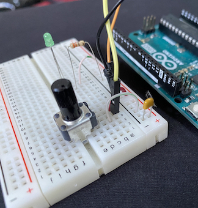
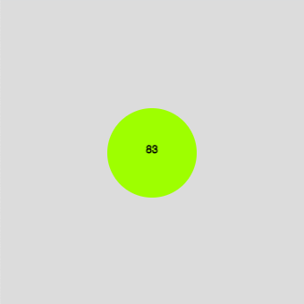

# basic-socket-p5
Simple NodeJS server to relay messages from a serial port device (e.g. Arduino) to a P5 sketch (webpage)



## Credits
Much of the socket.io-related code is from this excellent tutorial by Adam Thomas:

[Communicating from an Arduino to an HTML/JavaScript Webpage]
(https://www.youtube.com/watch?v=gQYsUjT-IBo)

## Overview

This setup allows a simple analog input on an Arduino to control
some aspect of a P5 sketch.  In this case, just the color of a filled circle.
It is just a simple demonstration. You are encouraged to add more features.


## Dependencies

This project requires **node** to run.
Instructions for installing it are here:
```
https://nodejs.dev/en/
```

Once **node** is installed, you will need to fetch the necessary packages, which are
described in `package.json`.
Run **npm** in the same directory where the files are:
```
npm install
```

If that works, then you are ready for the next steps.

## Instructions

Wire up a simple circuit that connects a potentiometer to the analog input A0
on your Arduino.

You will need to edit `app.js` to set it to your port.
Inside the Arduino IDE you can see which port the Arduino is attached to.
Instructions are inside the file (look for CONFIGURATION NEEDED).

Start your Arduino with the sketch from this repository called **basic-analog-out**.
Of course, the USB cable needs to stay connected to your computer.

Then, start the **node** server with:
```
node app.js
```

Then, start a web browser to view the results:
Visit this URL:
```
http://localhost:3000/
```
